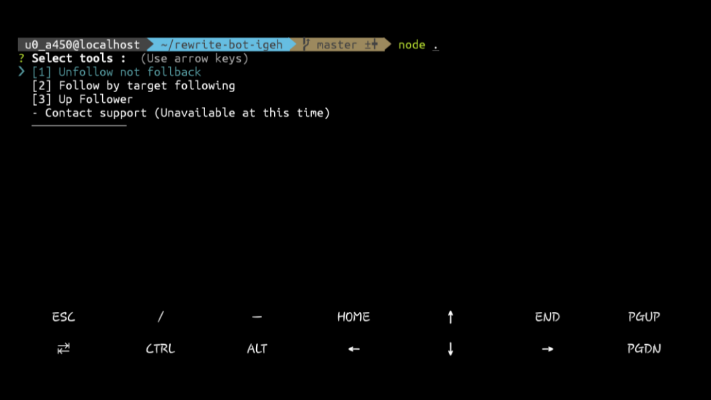

# bot-igeh
> Bot Instagram.
> Penambah followers

[![NPM Version][npm-image]][npm-url]

Use at your own discretion.



## Installation

Termux:

```sh
git clone https://github.com/Fauzibanh/upfolls-bot-ig
cd upfolls-bot-ig
npm install
```

## Meta

ZyyXtrime – [@spnx.fauzi](https://instagram.com/spnx.fauzi) – fauzixyz0@gmail.com
Rizqi – [@mrizqirmdhn_](https://instagram.com/mrizqirmdhn_) – tryaha78@gmail.com

[https://github.com/Fauzibanh/upfolls-bot-ig](https://github.com/Fauzibanh/)
[https://github.com/ZefianAlfian/rewrite-bot-igeh](https://github.com/ZefianAlfian/)

## Contributing

1. Fork it (<https://github.com/Fauzibanh/upfolls-bot-ig/fork>)
2. Create your feature branch (`git checkout -b feature/fooBar`)
3. Commit your changes (`git commit -am 'Add some fooBar'`)
4. Push to the branch (`git push origin feature/fooBar`)
5. Create a new Pull Request

## Special thanks

- [ZefianAlfian](https://github.com/rewrite-bot-igeh). Original Script.
- [Andi Muh. Rizqi](https://github.com/ikiganteng/bot-igeh). Thanks to him for starting it.

<!-- Markdown link & img dfn's -->
[npm-image]: https://img.shields.io/npm/v/datadog-metrics.svg?style=flat-square
[npm-url]: https://www.npmjs.com/package/instagram-private-api
